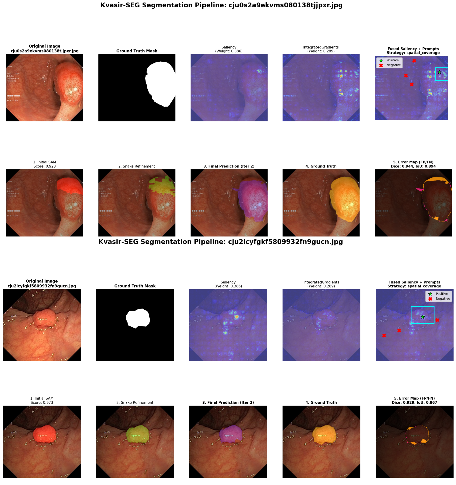

 

## LENAS

This repository provides the official implementation of **LENAS: Learning from Explainable and Navigated Attention for Annotation-Free Medical Image Segmentation**.

## The Problem
Medical image segmentation is the cornerstone of computer-aided diagnosis, yet it faces two critical hurdles:
1.  **Scarcity of Expert Annotations:** Unlike natural images, medical datasets lack the massive pixel-level annotations required to train robust models like the Segment Anything Model (SAM). Manual labeling is expensive, time-consuming, and requires skilled professionals.
2.  **Visual Complexity:** Pathological changes (lesions, polyps, tumors) often exhibit low contrast, subtle variations, and irregular boundaries that generic foundation models fail to capture without specific fine-tuning.

## Our Solution: LENAS
**LENAS** (Learning from Explainable and Navigated Attention for Annotation-Free Medical Image Segmentation) bridges the gap between **visual recognition** (classification) and **medical understanding** (segmentation).

Instead of relying on expensive pixel-level masks, LENAS uses **only image-level labels** (e.g., "polyp present") to achieve high-fidelity segmentation. It treats segmentation as a **vision-language grounding problem**, where the model autonomously:
1.  **Navigates** to the pathology using a specialized Differential BiomedCLIP.
2.  **Explains** the region using fused XAI maps (Saliency, Integrated Gradients, etc.).
3.  **Prompts** SAM automatically with these explanation maps.
4.  **Refines** the result through a self-correcting loop that optimizes for both classifier confidence and geometric smoothness.

## Key Features

- **Annotation-Free Segmentation**: Achieves high-fidelity segmentation without pixel-level supervision or manual bounding boxes, relying solely on image-level labels.
- **Differential BiomedCLIP**: A novel backbone that explicitly models pathology-context separation to isolate subtle pathological features from background noise.
- **Navigated Attention**: Transforms Explainable AI (XAI) maps into geometric spatial priors to automatically prompt the Segment Anything Model (SAM).
- **Self-Correcting Mechanism**: Features an iterative loop with a confidence-based reward system and Snake-based contour optimization to refine masks in real-time.

## Details

Universal foundation models for pathological segmentation often suffer from a profound gap between visual recognition and medical understanding. While models like SAM achieve robust performance on natural images, medical imaging is constrained by scarce expert annotations and subtle lesion variations.

In this work, we propose **LENAS** (Learning from Explainable and Navigated Attention for Annotation-Free Medical Image Segmentation). LENAS provides annotation-free segmentation as a unified vision–language challenge solved using navigated attention. The images are applied through navigated attention that guides the model’s focus to pathology-relevant regions under minimal supervision.

Our key contributions are:
1. A new **Differential BiomedCLIP** architecture whose differential attention layers excel at isolating subtle pathological features.
2. An **XAI-to-prompt pipeline** that translates classifier-derived representations into spatial priors for prompt-efficient segmentation with SAM.
3. An **iterative loop of self-evaluation** for classifier’s confidence on the resulting mask which serves as a real-time reward signal for prompt refinement.

<div align="center">
    
</div>

**Differential BiomedCLIP Backbone**

<div align="center">
    
</div>

## Quantitative Results


### 1. Classification Performance
LENAS achieves competitive or state-of-the-art classification accuracy across diverse medical imaging modalities, proving the robustness of the Differential BiomedCLIP backbone.

| Dataset | Model / Paper | Val Acc (%) |
| :--- | :--- | :---: |
| **Kvasir-SEG** | Ahmed et al., 2023 [37] | 90.17% |
| | Pozdeev et al., 2017 [38] | 88.00% |
| | Guo et al., 2024 (HyperKvasir) [39] | 88.92% |
| | SqueezeNet [40] | 79.15% |
| | **LENAS (Ours)** | **91.31%** |
| **ISIC (Skin lesions)** | Yilmaz et al., 2021 [41] | 82.00% |
| | Haenssle et al., 2018 [42] | 71.30% |
| | Alsahafi et al., 2023 (Skin-Net) [43] | 80.00% |
| | **LENAS (Ours)** | **82.78%** |
| **NIH–CXR (Chest X-ray)** | Shamrat et al., 2023 [44] | 91.60% |
| | Reshan et al., 2023 [45] | 90.85% |
| | Ait Nasser et al., 2023 [46] | 88–92% |
| | **LENAS (Ours)** | **93.03%** |
| **Figshare Brain Tumor** | Cheng et al., 2015 [36] | 91.28% |
| | Akter et al., 2024 [47] | 95.10% |
| | Talukder et al., 2023 [48] | 99.76% |
| | Ullah et al., 2023 (TumorDetNet) [49] | **99.83%** |
| | **LENAS (Ours)** | **98.04%** |

### 2. Segmentation Performance
Comparison of annotation-free segmentation performance on **Kvasir-SEG** (Polyp) and **BUSI** (Breast Ultrasound) datasets. LENAS significantly outperforms weakly supervised baselines.

| Method | Kvasir-SEG (Dice) | Kvasir-SEG (IoU) | BUSI (Dice) | BUSI (IoU) |
| :--- | :---: | :---: | :---: | :---: |
| GradCAM | 0.1034 | 0.0600 | -- | -- |
| ScribbleUNet | 0.2522 | 0.1565 | -- | -- |
| U-Net (1% labels) | 0.1760 | 0.2760 | 0.0019 | 0.0010 |
| U-Net (5% labels) | 0.1760 | 0.2760 | 0.1745 | 0.1076 |
| **LENAS (Ours)** | **0.3459** | **0.2612** | **0.3491** | **0.2731** |

## Qualitative Results

**Visualizations of pathological lesion localization and segmentation**

The figure below demonstrates the LENAS pipeline: generating fused saliency maps, deriving initial SAM masks, applying Snake refinement, and producing the final prediction.

<div align="center">
    
</div>

## Get started

**Installation**

```shell
# create a new conda environment
conda create -n LENAS python=3.9
conda activate LENAS

# install torch (adjust cuda version as needed)
pip install torch torchvision torchaudio --index-url https://download.pytorch.org/whl/cu118

# install requirements
pip install -r requirements.txt
```

## Data Preparation

Please download the datasets from the official sources below and organize them into the `data/` directory:

- **Kvasir-SEG**: [Download Here](https://datasets.simula.no/kvasir-seg/)
- **BUSI (Breast Ultrasound)**: [Download Here](https://data.mendeley.com/datasets/k6cpmwybk3/3)
- **ISIC (Skin Lesions)**: [Download Here](https://www.kaggle.com/datasets/nodoubttome/skin-cancer9-classesisic)
- **NIH-CXR (Chest X-ray)**: [Download Here](https://huggingface.co/datasets/alkzar90/NIH-Chest-X-ray-dataset)
- **Figshare Brain Tumor**: [Download Here](https://figshare.com/articles/dataset/brain_tumor_dataset/1512427)

Training (Classifier):
To train the Differential BiomedCLIP classifier using image-level labels:

```shell
python train_classifier.py --dataset kvasir --epochs 5 --batch_size 32
```

## Inference (Segmentation)
To run the full LENAS pipeline (XAI extraction → Prompt Generation → SAM → Refinement):

```shell
python main.py --image_path ./data/sample_image.jpg --output_dir ./results
```

## Feedback and Contact
For further questions regarding the code or paper, please feel free to contact:
Podakanti Satyajith Chary: es25resch11002@iith.ac.in

## License
This project is under the MIT License. See LICENSE for details.

## Acknowledgement
We thank the authors of **BiomedCLIP**, **Segment Anything (SAM)**, and **Quantus** for making their valuable work publicly available.
