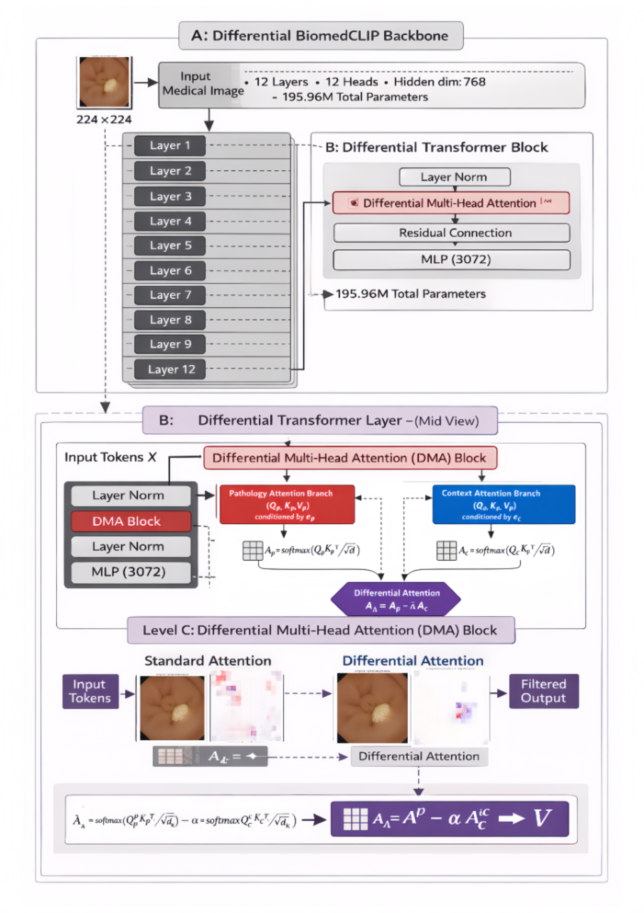

<div align="center">
    
</div>

## LENAAFMIS

This repository provides the official implementation of **LENAAFMIS: Learning from Explainable and Navigated Attention for Annotation-Free Medical Image Segmentation** (Communications AI & Computing). The method was released earlier under the name LENAS; the repository name is kept so that existing links continue to work.

The version of the code used in the article is archived on Zenodo: https://doi.org/10.5281/zenodo.XXXXXXX

## The Problem
Medical image segmentation is the cornerstone of computer-aided diagnosis, yet it faces two critical hurdles:
1.  **Scarcity of Expert Annotations:** Unlike natural images, medical datasets lack the large pixel-level annotations required to train robust segmentation models. Manual labeling is expensive, time-consuming, and requires skilled professionals.
2.  **Visual Complexity:** Pathological changes (lesions, polyps, tumors) often exhibit low contrast, subtle variations, and irregular boundaries that generic foundation models fail to capture without specific fine-tuning.

## Our Solution: LENAAFMIS
**LENAAFMIS** bridges the gap between **visual recognition** (classification) and **medical understanding** (segmentation).

Instead of relying on pixel-level masks, LENAAFMIS uses **only image-level labels** (e.g., "polyp present") to segment the pathological region. Pixel masks are used only for evaluation. The model:
1.  **Navigates** to the pathology using a Differential BiomedCLIP classifier.
2.  **Explains** the region using fused XAI maps (Saliency, Integrated Gradients, GradientSHAP), weighted by quantitative explainability metrics.
3.  **Prompts** SAM (ViT-B) automatically with points and boxes derived from these maps.
4.  **Refines** the result through a self-correcting loop in which the classifier's confidence selects the best mask, followed by Snake-based contour refinement.

## Key Features

- **Annotation-Free Segmentation**: No pixel-level supervision, manual clicks, or bounding boxes; only image-level labels.
- **Differential BiomedCLIP**: Pathology and context attention branches whose difference suppresses background activations and isolates subtle pathological features.
- **Navigated Attention**: Explainable AI (XAI) maps are converted into spatial prompts for the Segment Anything Model (SAM).
- **Self-Correcting Mechanism**: A confidence-based reward selects among prompt hypotheses, and a Snake contour refines the final boundary.

## Details

Universal foundation models for pathological segmentation often suffer from a gap between visual recognition and medical understanding. While models like SAM achieve robust performance on natural images, medical imaging is constrained by scarce expert annotations and subtle lesion variations.

LENAAFMIS treats annotation-free segmentation as a vision–language problem solved through navigated attention, which guides the model's focus to pathology-relevant regions using image-level labels only.

The key contributions are:
1. A **Differential BiomedCLIP** architecture whose differential attention layers isolate subtle pathological features. Each block computes the difference of a pathology and a context attention map, `A_diff = softmax(Q_p K_p^T / sqrt(d_k)) - alpha * softmax(Q_c K_c^T / sqrt(d_k))`, with a learnable `alpha` initialised at 0.8.
2. An **XAI-to-prompt pipeline** that translates classifier-derived explanations into spatial priors for prompt-efficient segmentation with SAM.
3. An **iterative loop of self-evaluation**, in which the classifier's confidence on the resulting mask serves as a reward signal for prompt refinement.

**Differential BiomedCLIP Backbone**

<div align="center">
    
</div>

## Quantitative Results

### 1. Segmentation Performance
Segmentation on **Kvasir-SEG** (polyps) and **BUSI** (breast ultrasound). LENAAFMIS uses no pixel-level masks, whereas the U-Net baselines are trained with the indicated fraction of masks.

| Method | Kvasir-SEG (Dice) | Kvasir-SEG (IoU) | BUSI (Dice) | BUSI (IoU) |
| :--- | :---: | :---: | :---: | :---: |
| GradCAM | 0.1034 | 0.0600 | -- | -- |
| ScribbleUNet | 0.2522 | 0.1565 | -- | -- |
| U-Net (1% labels) | 0.2590 | 0.1620 | 0.1231 | 0.0740 |
| U-Net (5% labels) | 0.4390 | 0.3210 | 0.4308 | 0.3140 |
| U-Net (10% labels) | 0.3867 | 0.2810 | 0.4313 | 0.3150 |
| U-Net (100% labels) | 0.7450 | 0.6210 | 0.6873 | 0.5560 |
| **LENAAFMIS (Ours)** | **0.5981** | **0.4818** | **0.3335** | **0.2490** |

Kvasir-SEG results use all 1000 images; BUSI results use a fixed random subset of 200 lesion images. Across three random seeds, LENAAFMIS obtains 0.585 ± 0.011 (Kvasir-SEG) and 0.304 ± 0.010 (BUSI).

<div align="center">
    
</div>

### 2. Comparison with Zero-Shot and Label-Free Methods
Mean Dice (%). SAM 2 uses ground-truth clicks and is shown only as an interactive upper bound.

| Method | Prompt | Kvasir-SEG | BUSI |
| :--- | :---: | :---: | :---: |
| SaLIP | text | 32.35 | 19.39 |
| MedCLIP-SAM | text | 56.29 | 10.60 |
| MedCLIP-SAM-v2 | text | 44.57 | 34.26 |
| AutoMiSeg (base) | auto | 25.94 | 15.72 |
| CLIPSeg | text | 52.51 | 2.95 |
| SAM (automatic) | auto | 27.77 | -- |
| SAM 3 ("lesion") | text | 21.59 | 37.07 |
| **LENAAFMIS (Ours)** | image-level label | **58.51** | 30.49 |
| SAM 2 (1 click, ground truth) | GT point | 72.97 | 72.12 |

LENAAFMIS gives the highest annotation-free Dice on Kvasir-SEG and is competitive on BUSI.

### 3. Ablation

| Variant | Kvasir-SEG (Dice) | BUSI (Dice) |
| :--- | :---: | :---: |
| **Full model** | **0.6233** | **0.3335** |
| No iterative self-correction | 0.5919 | 0.3332 |
| No refinement (no snake, no iteration) | 0.6085 | 0.3193 |
| No SAM (saliency thresholding) | 0.4634 | 0.2632 |
| Standard classifier instead of Differential BiomedCLIP | 0.3068 | -- |

The ablation uses a fixed subset of 200 images per dataset. With a standard classifier, the attribution maps become diffuse (normalised attribution entropy 0.969 vs 0.949 on Kvasir-SEG and 0.975 vs 0.953 on BUSI), and the rate of empty predictions on Kvasir-SEG rises from 3.3% to 22.5%.

### 4. Classification Performance
Validation accuracy of the classification backbone across medical imaging modalities.

| Dataset | Model / Paper | Val Acc (%) |
| :--- | :--- | :---: |
| **Kvasir-SEG** | [Ahmed et al., 2023](https://doi.org/10.3390/diagnostics13101758) | 90.17% |
| | [Pozdeev et al., 2017](https://doi.org/10.1109/EIConRus.2019.8657018) | 88.00% |
| | [Guo et al., 2024 (HyperKvasir)](https://doi.org/10.1038/s41598-024-53955-8) | 88.92% |
| | [SqueezeNet Survey](https://arxiv.org/abs/1602.07360) | 79.15% |
| | **LENAAFMIS (Ours)** | **91.11%** |
| **ISIC (Skin lesions)** | [Yilmaz et al., 2021](https://arxiv.org/abs/2110.12270) | 82.00% |
| | [Haenssle et al., 2018](https://doi.org/10.1093/annonc/mdy166) | 71.30% |
| | [Alsahafi et al., 2023 (Skin-Net)](https://doi.org/10.1186/s40537-023-00769-6) | 80.00% |
| | **LENAAFMIS (Ours)** | **82.78%** |
| **NIH–CXR (Chest X-ray)** | [Shamrat et al., 2023](https://doi.org/10.1016/j.compbiomed.2023.106646) | 91.60% |
| | [Reshan et al., 2023](https://doi.org/10.3390/healthcare11111561) | 90.85% |
| | [Ait Nasser et al., 2023](https://doi.org/10.3390/diagnostics13010159) | 88–92% |
| | **LENAAFMIS (Ours)** | **93.03%** |
| **Figshare Brain Tumor** | [Cheng et al., 2015](https://doi.org/10.1371/journal.pone.0140381) | 91.28% |
| | [Akter et al., 2024](https://doi.org/10.1038/s41598-024-74731-8) | 95.10% |
| | [Talukder et al., 2023](https://arxiv.org/abs/2305.12844) | 99.76% |
| | [Ullah et al., 2023 (TumorDetNet)](https://doi.org/10.1371/journal.pone.0291200) | **99.83%** |
| | **LENAAFMIS (Ours)** | **98.04%** |

For the Kvasir-SEG group, the classification backbone is trained on the Capsule Vision Challenge data.

## Qualitative Results

**Visualizations of pathological lesion localization and segmentation**

The figures below show the LENAAFMIS pipeline: fused saliency maps and prompts, the initial SAM mask, Snake refinement, and the final prediction.

<div align="center">
    
</div>

<div align="center">
    
</div>

## Get started

**Installation**

```shell
# create a new conda environment
conda create -n lenaafmis python=3.12
conda activate lenaafmis

# install torch (adjust cuda version as needed, see https://pytorch.org)
pip install torch torchvision

# install requirements
pip install -r requirements.txt
```

Download the SAM ViT-B checkpoint (`sam_vit_b_01ec64.pth`) from the official [Segment Anything](https://github.com/facebookresearch/segment-anything) repository.

## Data Preparation

Please download the datasets from the official sources below:

- **Capsule Vision Challenge (CVC)**: [Download Here](https://figshare.com/articles/dataset/Training_and_Validation_Dataset_of_Capsule_Vision_2024_Challenge/26403469)
- **Kvasir-SEG**: [Download Here](https://datasets.simula.no/kvasir-seg/)
- **BUSI (Breast Ultrasound)**: [Download Here](https://scholar.cu.edu.eg/?q=afahmy/pages/dataset)
- **ISIC 2017 (Skin Lesions)**: [Download Here](https://challenge.isic-archive.com/data/)
- **NIH-CXR (Chest X-ray)**: [Download Here](https://nihcc.app.box.com/v/ChestXray-NIHCC)
- **Figshare Brain Tumor**: [Download Here](https://doi.org/10.6084/m9.figshare.1512427)

## Reproducing the Results in the Article

The results reported in the article are produced by the scripts in the [`lenas_revision/`](lenas_revision/) folder. Run them from inside that folder after setting the dataset and checkpoint paths listed in `lenas_revision/PATHS_TO_SET.md`.

```shell
cd lenas_revision

# train the classifier with image-level labels only
python train_lenas_classifier.py --dataset kvasir
python train_lenas_classifier.py --dataset busi

# segmentation
python LENAS_Kvasir_revised.py
python lenas_busi_run.py

# baselines, ablation, sensitivity and variability
python lenas_revision_experiments.py
python lenas_busi_experiments.py
```

Every experiment script accepts `--smoke` for a quick test run. The mapping of each script to the tables of the article is given in [`lenas_revision/README.md`](lenas_revision/README.md). No data augmentation is used; images are processed with the native BiomedCLIP preprocessing only.

## Inference (Segmentation)
To run the original modular pipeline on a single image (XAI extraction → Prompt Generation → SAM → Refinement):

```shell
python main.py --image_path ./data/sample_image.jpg --output_dir ./results
```

## Citation
If you find this work useful, please cite:

```bibtex
@article{chary2026lenaafmis,
  title   = {LENAAFMIS: Learning from Explainable and Navigated Attention for Annotation-Free Medical Image Segmentation},
  author  = {Chary, Podakanti Satyajith and Kumar, Pithani Teja Venkata Ramana and Ganapathy, Nagarajan},
  journal = {Communications AI \& Computing},
  year    = {2026}
}
```

Code archive: https://doi.org/10.5281/zenodo.XXXXXXX

## Feedback and Contact
For further questions regarding the code or paper, please feel free to contact:
Podakanti Satyajith Chary: es25resch11002@iith.ac.in

## License
This project is under the MIT License. See [LICENSE](LICENSE) for details.

## Acknowledgement
We thank the authors of **BiomedCLIP**, **Segment Anything (SAM)**, and **Quantus** for making their valuable work publicly available.
